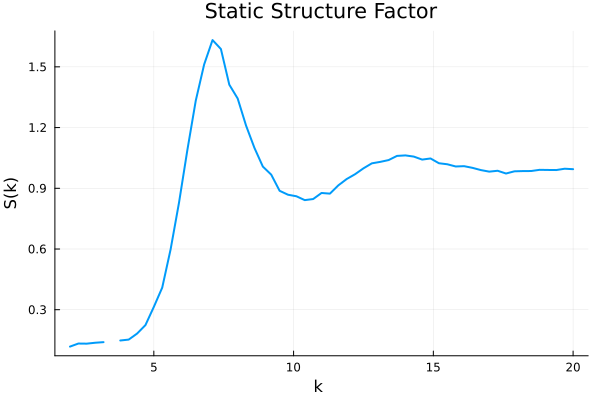
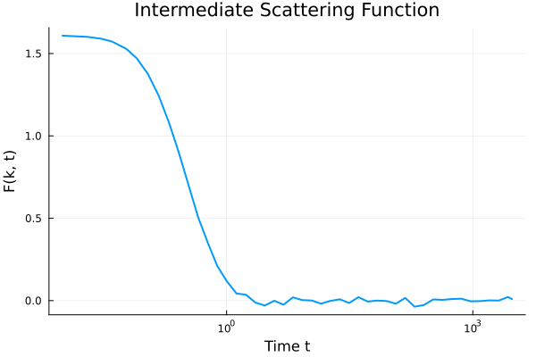
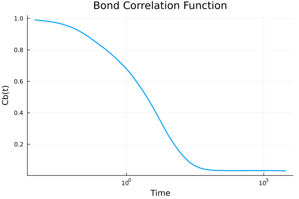
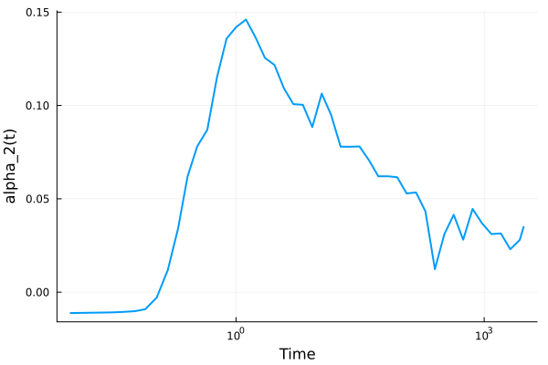

# Examples

This page provides examples for various analysis functions available in `SimulationAnalysis.jl`.

## Common Setup

All examples on this page use a sample trajectory file included with the package. The following code loads the simulation data and will be used as a common starting point for the examples below. We also assume that you have `Plots.jl` installed for the plotting examples.

```julia
using SimulationAnalysis
using Plots

# Construct the path to the test trajectory file
filepath = joinpath(dirname(pathof(SimulationAnalysis)), "..", "test", "data", "test_trajectory.h5")

# Load the simulation into a SingleComponentSimulation object
# If you have access to the data in some other format, you need to 
# construct a Simulation object manually.
sim = SimulationAnalysis.read_simulation_Berthier(filepath; time_origins=10)
display(sim)
```
```
Reading data file
This is a SingleComponentSimulation.
It contains the fields:
N: 1000
Ndims: 3
Nt: 430
dt: 0.01
r_array: Array{Float64, 3}
v_array: Array{Float64, 3}
F_array: Array{Float64, 3}
D_array: Vector{Float64}
t_array: Vector{Float64}
box_sizes: Vector{Float64}
dt_array: Vector{Float64}
t1_t2_pair_array: Vector{Matrix{Int64}}
filepath: C:\Users\Ilian\.julia\dev\SimulationAnalysis\src\..\test\data\test_trajectory.h5
```

So as we can see, we have loaded a simulation object of 1000 particles with 430 saved frames, at the time points given by `t_array`.

---


## Radial Distribution Function (g(r))

The radial distribution function describes the structure of the system.

```julia
# Set parameters for g(r) calculation
Nbins = 100
rmax = 5.0

# Calculate the radial distribution function
bin_centres, g_r = SimulationAnalysis.find_radial_distribution_function(sim, Nbins, rmax)

# Plot the g(r)
plot(bin_centres, g_r,
    xlabel="r (particle diameters)",
    ylabel="g(r)",
    title="Radial Distribution Function",
    legend=false,
    lw=2
)
```


---

## K-Space Analysis

These functions are used for analyzing the structure and dynamics in reciprocal space.

### Constructing K-Space

First, we need to construct the k-space vectors.

```julia
# Use only wave vectors with a length between 0 and 10
kbounds = (0.0, 20.0)
# Construct the k-space vectors
kspace = SimulationAnalysis.construct_k_space(sim, kbounds)
```
```
This is a SimulationAnalysis.KSpace{3, SimulationAnalysis.SingleComponentSimulation, OffsetArrays.OffsetArray{Int64, 3, Array{Int64, 3}}}.
It contains 
s: SimulationAnalysis.SingleComponentSimulation
Nk: 2418
k_lengths: Vector{Float64}
k_array: Matrix{Float64}
kfactor: 1
cartesian_to_linear: OffsetArrays.OffsetArray{Int64, 3, Array{Int64, 3}}
```
We can compute the corresponding density modes. These are used to construct scattering functions. They are defines as
$\rho(k,t)=\sum_j \exp(i \mathbf{k}\cdot\mathbf{r}_j),$
where the index $j$ runs over all particles.
```julia
density_modes = SimulationAnalysis.find_density_modes(sim, kspace; verbose=true)
```
```
SingleComponentDensityModes with real and imaginary parts of size (430, 2418).
```

### Structure Factor (S(k))

The structure factor is the Fourier transform of the radial distribution function and describes the static correlations in the system.

```julia
# Calculate the structure factor averaged over a specific shell in kspace
S_k = SimulationAnalysis.find_structure_factor(sim; kmin=2.0, kmax=2.4)

println("Structure factor calculated: ", S_k)
```
```
Structure factor calculated: 0.12698982578981327
```

If the goal is to compute S(k) at many different points in k, it is more efficient to use the precomputed density modes from above
```julia
# Calculate the structure factor for a specific k-range
k_sample_arr = 2:0.3:20
S_k = SimulationAnalysis.find_structure_factor(sim, kspace, density_modes, k_sample_arr; k_binwidth=0.1)
plot(k_sample_arr, S_k,
    xlabel="k ",
    ylabel="S(k)",
    title="Static Structure Factor",
    legend=false,
    lw=2
)
```
The code above computes the structure factor for each $k_i$ in `k_sample_arr`, averaged over all `k\in (k_i - k_binwidth/2, k_i + k_binwidth/2)`. It produces the following plot:




The gap in the figure is caused by the absence of any wave vectors that have the length corresponding to that bin. 

---

### Intermediate Scattering Function (ISF)

The intermediate scattering function, F(k, t), measures the decay of density correlations at a specific wave vector `k` over time `t`.

```julia
# Calculate the intermediate scattering function for a specific k-range
isf = SimulationAnalysis.find_intermediate_scattering_function(sim; kmin=7.0, kmax=7.4)

# Plot the ISF
plot(sim.dt_array[2:end], isf[2:end],
    xlabel="Time t",
    ylabel="F(k, t)",
    title="Intermediate Scattering Function",
    legend=false,
    lw=2,
    xaxis=:log
)
```


We could have used the precomputed density modes for performance here, see the API documentation.

### Self-Intermediate Scattering Function (Self-ISF)

The self-intermediate scattering function, F_s(k, t), is the single-particle equivalent of the ISF. It measures the correlation of a single particle's position over time.

```julia
# Calculate the self-intermediate scattering function
self_isf, self_isf_per_particle = SimulationAnalysis.find_self_intermediate_scattering_function(sim, kspace; kmin=7.0, kmax=7.4)

# Plot the Self-ISF
plot(sim.dt_array[2:end], self_isf[2:end],
    xlabel="Time",
    ylabel="F_s(k, t)",
    title="Self-Intermediate Scattering Function",
    legend=false,
    lw=2,
    xaxis=:log
)
```


---

## Neighbor Lists

Neighbor lists are used to efficiently find particles that are close to each other. These functions return lists of neighbors and are not typically plotted directly.

### Absolute Distance Neighbor List

This method finds all particles within a certain absolute distance of each other.

```julia
# Find neighbor lists based on a cutoff distance
neighborlists_abs = SimulationAnalysis.find_absolute_distance_neighborlists(sim, 2.0)

println("Absolute distance neighbor lists calculated for ", length(neighborlists_abs), " time steps.")
```
```
Absolute distance neighbor lists calculated for 430 time steps.
```

### Voronoi Neighbor List

This method uses Voronoi tessellation to determine neighbors. 

THIS IS CURRENTLY BROKEN IN 3D ON JULIA 1.11 (Quickhull.jl segfaults)

```julia
# Find neighbor lists using Voronoi tessellation
neighborlists_voronoi = SimulationAnalysis.find_voronoi_neighborlists(sim)

println("Voronoi neighbor lists calculated for ", length(neighborlists_voronoi), " time steps.")
```
```
Voronoi neighbor lists calculated for 430 time steps.
```
---

## Bond Correlation Function (Cb)

The bond correlation function is used to study the dynamics of local structure. It requires neighbor lists as input.

```julia
# First, calculate neighbor lists
neighborlists = SimulationAnalysis.find_absolute_distance_neighborlists(sim, 2.0)

# Calculate the bond correlation function for each particle
Cb_per_particle = SimulationAnalysis.find_CB(sim, neighborlists, neighborlists)
# average over particles
Cb = sum(Cb_per_particle, dims=2)[:] / size(Cb_per_particle, 2)

# Plot the bond correlation function for a single particle
plot(sim.dt_array[2:end], Cb[2:end],
    xlabel="Time",
    ylabel="Cb(t)",
    title="Bond Correlation Function",
    legend=false,
    lw=2,
    xscale=:log10
)
```



## Mean Squared Displacement (MSD)

The mean squared displacement is a measure of the average distance a particle travels over time. By default, the particles are stored as mapped into the main box. Therefore we need to reconstruct the data with the original trajectories.
```julia
# Calculate the mean squared displacement
sim_original = SimulationAnalysis.read_simulation_Berthier(filepath;
             time_origins=10, original=true)
msd = SimulationAnalysis.find_mean_squared_displacement(sim_original)

# Plot the MSD
plot(sim.dt_array[2:end], msd[2:end],
    xlabel="Time",
    ylabel="MSD",
    title="Mean Squared Displacement",
    legend=false,
    lw=2,
    xscale=:log10,
    yscale=:log10,
)
```


---

## Non-Gaussian parameter ($\alpha_2$)

The non-Gaussian parameter is a measure of the non-Gaussianity in the system. It is defined as
$\alpha_2(t) = \frac{d}{d+2}\frac{MQD(t)}{MSD(t)^2}-1$
where $MQD$ is the mean quartic displacement (fourth moment of the displacement distribution) and $d$ is the dimensionality.
```julia
a2 = SimulationAnalysis.find_non_gaussian_parameter(sim_original)

# Plot the MSD
plot(sim.dt_array[2:end], a2[2:end],
    xlabel="Time",
    ylabel="alpha_2(t)",
    legend=false,
    lw=2,
    xscale=:log10,
)
```


---