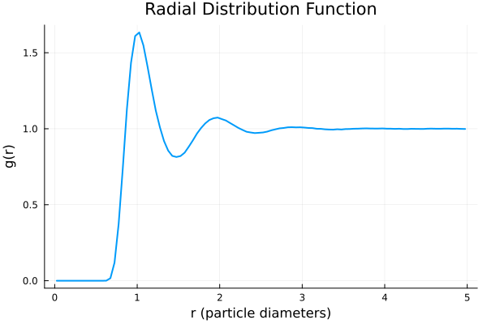

# Tutorial

This tutorial provides a step-by-step guide to using `SimulationAnalysis.jl` for analyzing particle-based simulation data. We will cover loading a simulation, calculating the radial distribution function, and visualizing the results.

## 1. Setting up the Environment

Before we begin, make sure you have `SimulationAnalysis.jl` and a plotting library like `Plots.jl` installed in your Julia environment.

```julia
using Pkg
Pkg.add("https://github.com/IlianPihlajamaa/SimulationAnalysis.jl")
Pkg.add("Plots")
```

## 2. Loading Simulation Data

`SimulationAnalysis.jl` supports various simulation formats. In this tutorial, we'll use a sample trajectory file included with the package. We will use the `read_continuously_hard_sphere_simulation` function to load the data into a `SingleComponentSimulation` object.

```julia
using SimulationAnalysis

# The test data is located in the `test/data` directory of the package.
# We can construct the path to the file like this:
filepath = joinpath(dirname(pathof(SimulationAnalysis)), "..", "test", "data", "test_trajectory.h5")

# Load the simulation data
# We specify the number of time origins to use for time correlation functions.
sim = SimulationAnalysis.read_continuously_hard_sphere_simulation(filepath; time_origins=10)
```

The `sim` object now holds all the simulation data, including particle positions, box dimensions, and time steps.

## 3. Calculating the Radial Distribution Function (g(r))

The radial distribution function, g(r), is a key quantity that describes the structure of a system. It measures the probability of finding a particle at a distance `r` from another particle.

Let's calculate g(r) for our simulation. We need to specify the number of bins and the maximum radius for the calculation.

```julia
# Set the parameters for the g(r) calculation
Nbins = 100
rmax = 10.0

# Calculate the radial distribution function
bin_centres, gr = find_radial_distribution_function(sim, Nbins, rmax)
```

The `find_radial_distribution_function` function returns two arrays: `bin_centres`, which contains the center of each radial bin, and `gr`, which contains the corresponding g(r) values.

## 4. Visualizing the Results

A plot is often the best way to interpret the g(r). Let's use `Plots.jl` to visualize the result.

```julia
using Plots

# Create a plot of the radial distribution function
plot(bin_centres, gr,
    xlabel="r (particle diameters)",
    ylabel="g(r)",
    title="Radial Distribution Function",
    legend=false,
    lw=2
)
```




This will generate a plot showing the characteristic peaks of the g(r) for a liquid-like structure. The first peak corresponds to the nearest neighbors, the second to the next-nearest neighbors, and so on.

This tutorial has demonstrated a basic workflow for analyzing simulation data with `SimulationAnalysis.jl`. You can explore the [Examples](examples.md) page for more advanced analysis techniques.
